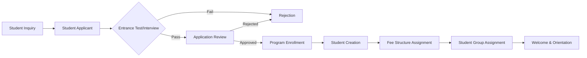
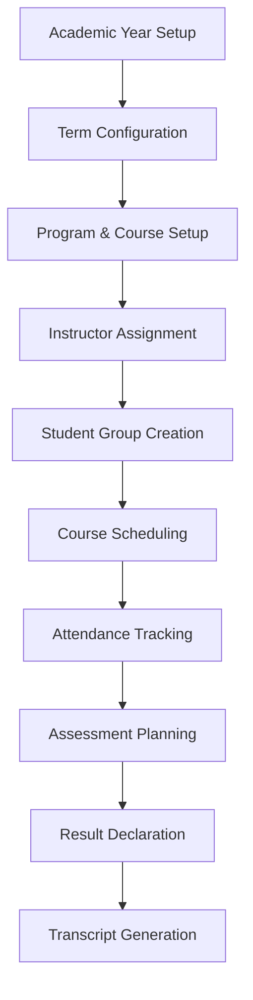
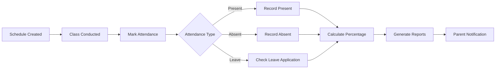
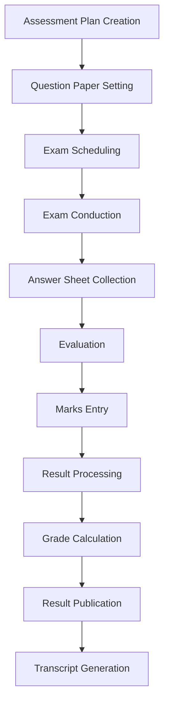
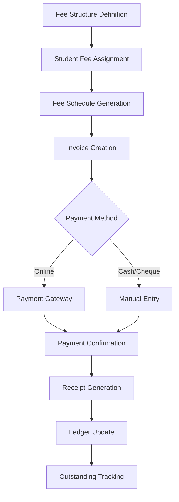
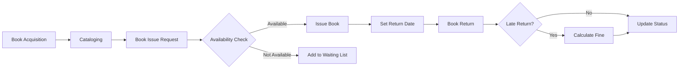
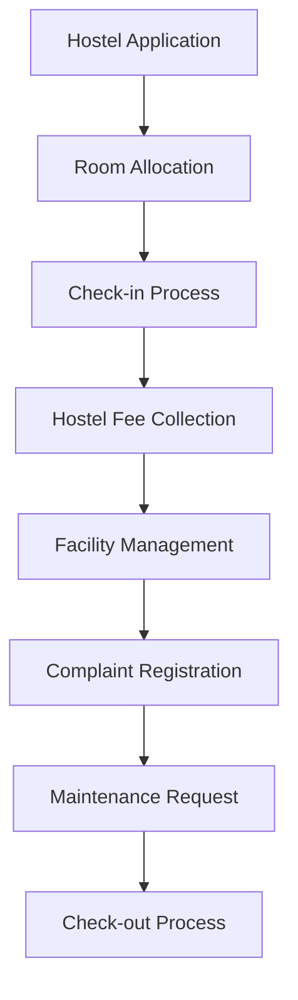
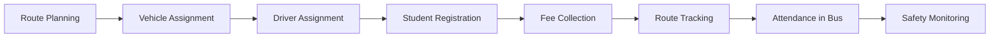

# ERPNext Education Module
## Complete Documentation & Workflows

### Table of Contents
1. [Module Overview](#module-overview)
2. [System Architecture](#system-architecture)
3. [Core Workflows](#core-workflows)
4. [Detailed Feature Documentation](#detailed-feature-documentation)
5. [Integration Points](#integration-points)
6. [Best Practices](#best-practices)
7. [Technical Implementation](#technical-implementation)

---

## Module Overview

### Purpose
ERPNext Education Module is a comprehensive Educational Resource Planning (ERP) solution designed to manage all aspects of educational institutions, from student admissions to graduation, including academic, financial, and administrative operations.

### Scope
- **Educational Levels**: Primary Schools to Universities
- **Institution Types**: Schools, Colleges, Universities, Training Centers
- **User Roles**: Students, Parents, Teachers, Administrators, Management
- **Functional Areas**: Academic, Financial, Administrative, HR, Communication

### Key Benefits
- Unified platform for all educational operations
- Real-time data access and reporting
- Automated workflows and processes
- Cost-effective open-source solution
- Scalable architecture
- Mobile and web accessibility

---

## System Architecture

### Technical Stack
```yaml
Framework: Frappe Framework v14+
Backend: Python 3.10+
Database: MariaDB 10.3+ / PostgreSQL 13+
Frontend: Vue.js, JavaScript
API: REST API with JSON
Cache: Redis
Queue: RQ (Redis Queue)
Search: Elasticsearch (optional)
```

### Module Dependencies
```
ERPNext Education Module
├── Core Frappe Framework
├── ERPNext HR Module (for staff management)
├── ERPNext Accounts Module (for financial operations)
├── ERPNext Assets Module (for infrastructure)
└── ERPNext Communication Module (for messaging)
```

### Data Model Overview
```
┌─────────────────────────────────────────────────────────────┐
│                    MASTER DATA                             │
├─────────────────────────────────────────────────────────────┤
│  Academic Structure:                                        │
│  ├── Academic Year → Academic Term                         │
│  ├── Program → Course → Topic                              │
│  ├── Department → Instructor                               │
│  └── Room → Facility                                       │
│                                                             │
│  Student Data:                                              │
│  ├── Student Applicant → Student                           │
│  ├── Student → Guardian                                    │
│  ├── Student → Student Group                               │
│  └── Student → Program Enrollment                          │
│                                                             │
│  Financial Structure:                                       │
│  ├── Fee Structure → Fee Category                          │
│  ├── Fee Schedule → Fees                                   │
│  └── Payment Entry → General Ledger                        │
└─────────────────────────────────────────────────────────────┘
```

---

## Core Workflows

### 1. Student Admission Workflow



**Detailed Steps:**

#### 1.1 Student Inquiry Management
```python
# Workflow: Student Inquiry
def create_student_inquiry():
    """
    1. Capture basic information (name, contact, program interest)
    2. Create Lead/Prospect in CRM (optional)
    3. Send automated acknowledgment email
    4. Assign to admission counselor
    5. Schedule follow-up activities
    """
    inquiry = frappe.new_doc("Student Applicant")
    inquiry.first_name = "John"
    inquiry.last_name = "Doe"
    inquiry.program = "Bachelor of Technology"
    inquiry.application_status = "Applied"
    inquiry.insert()
```

#### 1.2 Application Processing
```python
# Workflow: Application Review
def process_application(applicant_name):
    """
    1. Verify documents
    2. Check eligibility criteria
    3. Schedule entrance test/interview
    4. Record test results
    5. Calculate merit score
    6. Generate admission decision
    """
    applicant = frappe.get_doc("Student Applicant", applicant_name)

    # Document verification
    if verify_documents(applicant):
        applicant.document_verified = 1

    # Eligibility check
    if check_eligibility(applicant):
        applicant.eligibility_status = "Eligible"

    # Test scheduling
    schedule_entrance_test(applicant)

    # Merit calculation
    applicant.merit_score = calculate_merit(applicant)
    applicant.save()
```

#### 1.3 Enrollment Process
```python
# Workflow: Student Enrollment
def enroll_student(applicant_name):
    """
    1. Create Student from Applicant
    2. Generate Student ID
    3. Create Program Enrollment
    4. Assign Academic Year and Term
    5. Generate Fee Structure
    6. Create Student User Account
    """
    applicant = frappe.get_doc("Student Applicant", applicant_name)

    # Create student
    student = frappe.new_doc("Student")
    student.first_name = applicant.first_name
    student.last_name = applicant.last_name
    student.student_email_id = applicant.email
    student.insert()

    # Create enrollment
    enrollment = frappe.new_doc("Program Enrollment")
    enrollment.student = student.name
    enrollment.program = applicant.program
    enrollment.academic_year = get_current_academic_year()
    enrollment.insert()

    # Assign fees
    assign_fee_structure(student, enrollment)
```

### 2. Academic Management Workflow



#### 2.1 Academic Setup
```python
# Workflow: Academic Configuration
def setup_academic_year():
    """
    1. Create Academic Year
    2. Define Academic Terms (Semesters/Quarters)
    3. Set Holiday List
    4. Configure Grading Scale
    5. Define Assessment Criteria
    """
    # Academic Year
    academic_year = frappe.new_doc("Academic Year")
    academic_year.academic_year_name = "2024-25"
    academic_year.year_start_date = "2024-07-01"
    academic_year.year_end_date = "2025-06-30"
    academic_year.insert()

    # Academic Terms
    terms = ["Semester 1", "Semester 2"]
    for term_name in terms:
        term = frappe.new_doc("Academic Term")
        term.academic_year = academic_year.name
        term.term_name = term_name
        term.insert()
```

#### 2.2 Course Management
```python
# Workflow: Course Setup and Management
def setup_course_structure():
    """
    1. Create Programs (Degrees/Diplomas)
    2. Define Courses within Programs
    3. Add Topics to Courses
    4. Set Credit Hours
    5. Define Prerequisites
    6. Assign Instructors
    """
    # Program creation
    program = frappe.new_doc("Program")
    program.program_name = "Bachelor of Technology"
    program.program_code = "BTECH"
    program.department = "Engineering"
    program.insert()

    # Course creation
    course = frappe.new_doc("Course")
    course.course_name = "Data Structures"
    course.course_code = "CS201"
    course.department = "Computer Science"
    course.credits = 4
    course.insert()

    # Link course to program
    program_course = frappe.new_doc("Program Course")
    program_course.program = program.name
    program_course.course = course.name
    program_course.required = 1
    program_course.insert()
```

#### 2.3 Schedule Management
```python
# Workflow: Timetable Creation
def create_course_schedule():
    """
    1. Define time slots
    2. Assign rooms to courses
    3. Set instructor availability
    4. Generate weekly schedule
    5. Handle conflicts
    6. Publish timetable
    """
    schedule = frappe.new_doc("Course Schedule")
    schedule.student_group = "BTECH-CS-2024"
    schedule.course = "Data Structures"
    schedule.instructor = "Dr. Smith"
    schedule.room = "Room 101"
    schedule.schedule_date = "2024-07-15"
    schedule.from_time = "09:00:00"
    schedule.to_time = "10:30:00"

    # Check conflicts
    if not check_schedule_conflict(schedule):
        schedule.insert()
    else:
        resolve_conflict(schedule)
```

### 3. Attendance Management Workflow



#### 3.1 Attendance Tracking
```python
# Workflow: Daily Attendance
def mark_student_attendance():
    """
    1. Get student list for class
    2. Mark attendance status
    3. Record timestamp
    4. Handle late arrivals
    5. Process leave applications
    6. Calculate running percentage
    7. Send notifications
    """
    attendance = frappe.new_doc("Student Attendance")
    attendance.student = "STU001"
    attendance.student_group = "BTECH-CS-2024"
    attendance.date = frappe.utils.today()
    attendance.status = "Present"  # Present/Absent/Half Day
    attendance.insert()

    # Calculate percentage
    calculate_attendance_percentage(attendance.student)

    # Send notification if below threshold
    if get_attendance_percentage(attendance.student) < 75:
        send_low_attendance_alert(attendance.student)
```

#### 3.2 Leave Management
```python
# Workflow: Student Leave Application
def process_leave_application():
    """
    1. Student submits leave request
    2. Attach supporting documents
    3. Guardian approval (if minor)
    4. Teacher/HOD approval
    5. Update attendance records
    6. Notify relevant parties
    """
    leave = frappe.new_doc("Student Leave Application")
    leave.student = "STU001"
    leave.from_date = "2024-07-20"
    leave.to_date = "2024-07-22"
    leave.reason = "Medical"
    leave.insert()
    leave.submit()

    # Update attendance
    mark_leave_in_attendance(leave)
```

### 4. Assessment & Evaluation Workflow



#### 4.1 Assessment Planning
```python
# Workflow: Assessment Setup
def create_assessment_plan():
    """
    1. Define assessment criteria
    2. Set weightage for each component
    3. Schedule assessments
    4. Assign evaluators
    5. Set grading scale
    """
    plan = frappe.new_doc("Assessment Plan")
    plan.assessment_name = "Mid-Term Examination"
    plan.student_group = "BTECH-CS-2024"
    plan.course = "Data Structures"
    plan.assessment_criteria = [
        {"criteria": "Theory", "weightage": 70},
        {"criteria": "Practical", "weightage": 30}
    ]
    plan.maximum_score = 100
    plan.schedule_date = "2024-09-15"
    plan.insert()
```

#### 4.2 Result Processing
```python
# Workflow: Result Management
def process_assessment_result():
    """
    1. Collect marks from evaluators
    2. Apply grading formula
    3. Calculate CGPA/GPA
    4. Generate result sheets
    5. Approval workflow
    6. Publish results
    """
    result = frappe.new_doc("Assessment Result")
    result.assessment_plan = "Mid-Term Examination"
    result.student = "STU001"
    result.score = 85
    result.insert()

    # Calculate grade
    result.grade = calculate_grade(result.score)
    result.save()

    # Update student academic record
    update_student_gpa(result.student)
```

### 5. Fee Management Workflow



#### 5.1 Fee Structure Setup
```python
# Workflow: Fee Configuration
def setup_fee_structure():
    """
    1. Define fee categories
    2. Set amounts for each category
    3. Configure payment terms
    4. Set due dates
    5. Define late payment penalties
    6. Set up discounts/scholarships
    """
    # Fee Structure
    fee_structure = frappe.new_doc("Fee Structure")
    fee_structure.program = "Bachelor of Technology"
    fee_structure.academic_year = "2024-25"

    # Add fee components
    fee_structure.components = [
        {"fee_category": "Tuition Fee", "amount": 50000},
        {"fee_category": "Lab Fee", "amount": 10000},
        {"fee_category": "Library Fee", "amount": 2000},
        {"fee_category": "Sports Fee", "amount": 3000}
    ]
    fee_structure.total_amount = 65000
    fee_structure.insert()
```

#### 5.2 Fee Collection
```python
# Workflow: Fee Payment Processing
def process_fee_payment():
    """
    1. Generate fee invoice
    2. Send payment reminder
    3. Process payment
    4. Update payment status
    5. Generate receipt
    6. Update student ledger
    """
    # Create fees record
    fees = frappe.new_doc("Fees")
    fees.student = "STU001"
    fees.fee_structure = "BTECH-2024-25"
    fees.due_date = "2024-07-31"
    fees.grand_total = 65000
    fees.insert()

    # Process payment
    payment = frappe.new_doc("Payment Entry")
    payment.payment_type = "Receive"
    payment.party = fees.student
    payment.paid_amount = 65000
    payment.reference_no = "TXN123456"
    payment.insert()
    payment.submit()

    # Update fees status
    fees.payment_status = "Paid"
    fees.save()
```

### 6. Library Management Workflow



#### 6.1 Library Operations
```python
# Workflow: Library Management
def manage_library_transaction():
    """
    1. Book issue request
    2. Check availability
    3. Issue book to student
    4. Track due dates
    5. Process returns
    6. Calculate fines
    """
    # Book issue
    issue = frappe.new_doc("Library Transaction")
    issue.student = "STU001"
    issue.article = "Data Structures by Cormen"
    issue.transaction_type = "Issue"
    issue.issue_date = frappe.utils.today()
    issue.due_date = frappe.utils.add_days(frappe.utils.today(), 14)
    issue.insert()

    # Book return
    return_txn = frappe.get_doc("Library Transaction", issue.name)
    return_txn.transaction_type = "Return"
    return_txn.return_date = frappe.utils.today()

    # Calculate fine if late
    if return_txn.return_date > return_txn.due_date:
        days_late = date_diff(return_txn.return_date, return_txn.due_date)
        return_txn.fine_amount = days_late * 10  # ₹10 per day

    return_txn.save()
```

### 7. Hostel Management Workflow



#### 7.1 Hostel Operations
```python
# Workflow: Hostel Management
def manage_hostel_admission():
    """
    1. Receive hostel application
    2. Check room availability
    3. Allocate room
    4. Generate hostel fees
    5. Manage facilities
    6. Handle complaints
    """
    # Room allocation
    allocation = frappe.new_doc("Hostel Room Allocation")
    allocation.student = "STU001"
    allocation.hostel = "Boys Hostel A"
    allocation.room_number = "101"
    allocation.bed_number = "A"
    allocation.from_date = "2024-07-01"
    allocation.to_date = "2025-06-30"
    allocation.insert()

    # Generate hostel fees
    create_hostel_fees(allocation)
```

### 8. Transportation Management Workflow



#### 8.1 Transport Operations
```python
# Workflow: Transportation Management
def manage_transportation():
    """
    1. Define routes and stops
    2. Assign vehicles to routes
    3. Register students for transport
    4. Track vehicle location
    5. Monitor safety compliance
    """
    # Route creation
    route = frappe.new_doc("Transport Route")
    route.route_name = "Route 1 - North Zone"
    route.stops = [
        {"stop_name": "Main Gate", "pickup_time": "07:00"},
        {"stop_name": "City Center", "pickup_time": "07:15"},
        {"stop_name": "Park Avenue", "pickup_time": "07:30"}
    ]
    route.vehicle = "BUS001"
    route.driver = "EMP001"
    route.insert()

    # Student registration
    registration = frappe.new_doc("Transport Registration")
    registration.student = "STU001"
    registration.route = route.name
    registration.pickup_stop = "City Center"
    registration.insert()
```

---

## Detailed Feature Documentation

### Student Management Features

#### Student Profile Management
```python
class StudentProfile:
    """Complete student information management"""

    def __init__(self):
        self.personal_info = {
            'name': '',
            'date_of_birth': '',
            'gender': '',
            'blood_group': '',
            'nationality': '',
            'photo': ''
        }

        self.contact_info = {
            'address': '',
            'phone': '',
            'email': '',
            'emergency_contact': ''
        }

        self.academic_info = {
            'student_id': '',
            'program': '',
            'batch': '',
            'semester': '',
            'enrollment_date': '',
            'expected_graduation': ''
        }

        self.documents = {
            'birth_certificate': '',
            'previous_marksheets': [],
            'transfer_certificate': '',
            'migration_certificate': ''
        }
```

#### Guardian Management
```python
class GuardianManagement:
    """Parent/Guardian relationship and communication"""

    def create_guardian(self, student_id):
        guardian = frappe.new_doc("Guardian")
        guardian.guardian_name = "Parent Name"
        guardian.relation = "Father"
        guardian.occupation = "Professional"
        guardian.designation = "Manager"
        guardian.work_address = "Office Address"
        guardian.email = "parent@example.com"
        guardian.mobile_number = "+91-9999999999"
        guardian.alternate_number = "+91-8888888888"

        # Link to student
        guardian.students = [{"student": student_id}]
        guardian.insert()

        # Create portal access
        self.create_parent_portal_access(guardian)
```

### Academic Management Features

#### Curriculum Planning
```python
class CurriculumPlanning:
    """Academic curriculum design and management"""

    def create_curriculum():
        """
        Complete curriculum structure:
        Program → Semester → Courses → Topics → Learning Outcomes
        """
        curriculum = {
            'program': 'Bachelor of Technology',
            'duration': '4 Years',
            'total_credits': 160,
            'semesters': [
                {
                    'semester': 1,
                    'courses': [
                        {
                            'code': 'CS101',
                            'name': 'Programming Fundamentals',
                            'credits': 4,
                            'type': 'Core',
                            'topics': [
                                'Introduction to Programming',
                                'Data Types and Variables',
                                'Control Structures',
                                'Functions and Modules'
                            ]
                        }
                    ]
                }
            ]
        }
        return curriculum
```

#### Faculty Management
```python
class FacultyManagement:
    """Instructor and staff management"""

    def create_instructor_profile():
        instructor = frappe.new_doc("Instructor")
        instructor.employee = "EMP001"  # Link to HR Employee
        instructor.department = "Computer Science"
        instructor.designation = "Assistant Professor"
        instructor.specialization = "Machine Learning"
        instructor.qualifications = "PhD in Computer Science"
        instructor.experience_years = 5
        instructor.courses_taught = [
            "Data Structures",
            "Algorithms",
            "Machine Learning"
        ]
        instructor.research_interests = "AI, ML, Data Science"
        instructor.publications = []
        instructor.insert()
```

### Fee Management Features

#### Scholarship Management
```python
class ScholarshipManagement:
    """Scholarship and financial aid processing"""

    def process_scholarship():
        scholarship = frappe.new_doc("Scholarship")
        scholarship.student = "STU001"
        scholarship.scholarship_type = "Merit Based"
        scholarship.amount = 25000
        scholarship.percentage = 50  # 50% fee waiver
        scholarship.academic_year = "2024-25"
        scholarship.conditions = "Maintain 8.0 CGPA"
        scholarship.insert()

        # Apply to fee structure
        apply_scholarship_to_fees(scholarship)
```

#### Payment Plans
```python
class PaymentPlans:
    """Flexible payment options for students"""

    def create_installment_plan():
        plan = frappe.new_doc("Payment Plan")
        plan.student = "STU001"
        plan.total_amount = 65000
        plan.installments = [
            {"due_date": "2024-07-31", "amount": 32500},
            {"due_date": "2024-12-31", "amount": 32500}
        ]
        plan.insert()

        # Generate payment schedule
        generate_payment_reminders(plan)
```

### Communication Features

#### Notification System
```python
class NotificationSystem:
    """Multi-channel communication system"""

    def send_notification(self, recipient, message, channels):
        """
        Send notifications through multiple channels
        channels: ['email', 'sms', 'push', 'portal']
        """
        notification = frappe.new_doc("Notification Log")
        notification.recipient = recipient
        notification.subject = message['subject']
        notification.message = message['body']
        notification.channels = channels

        for channel in channels:
            if channel == 'email':
                send_email_notification(recipient, message)
            elif channel == 'sms':
                send_sms_notification(recipient, message)
            elif channel == 'push':
                send_push_notification(recipient, message)
            elif channel == 'portal':
                post_portal_notification(recipient, message)

        notification.status = "Sent"
        notification.insert()
```

#### Parent Communication
```python
class ParentCommunication:
    """Parent-teacher communication management"""

    def schedule_parent_meeting():
        meeting = frappe.new_doc("Parent Teacher Meeting")
        meeting.student = "STU001"
        meeting.guardian = "Guardian001"
        meeting.teacher = "Teacher001"
        meeting.date = "2024-08-15"
        meeting.time = "10:00"
        meeting.agenda = "Discuss academic progress"
        meeting.venue = "Conference Room 1"
        meeting.insert()

        # Send invitations
        send_meeting_invitation(meeting)
```

---

## Integration Points

### 1. ERPNext HR Integration
```python
# Link with HR for faculty and staff management
def integrate_with_hr():
    """
    Integration points:
    - Employee → Instructor
    - Attendance → Payroll
    - Leave Management
    - Performance Appraisal
    """
    # Sync instructor with employee
    employee = frappe.get_doc("Employee", "EMP001")
    instructor = frappe.new_doc("Instructor")
    instructor.employee = employee.name
    instructor.employee_name = employee.employee_name
    instructor.department = employee.department
    instructor.insert()
```

### 2. ERPNext Accounts Integration
```python
# Financial integration for fee management
def integrate_with_accounts():
    """
    Integration points:
    - Fee Collection → Journal Entry
    - Student Ledger → General Ledger
    - Cost Center mapping (Department-wise)
    - Budget tracking
    """
    # Create journal entry for fee payment
    je = frappe.new_doc("Journal Entry")
    je.voucher_type = "Journal Entry"
    je.posting_date = frappe.utils.today()
    je.accounts = [
        {
            "account": "Cash - School",
            "debit_in_account_currency": 65000
        },
        {
            "account": "Fees Collected - School",
            "credit_in_account_currency": 65000,
            "cost_center": "Computer Science Department"
        }
    ]
    je.insert()
    je.submit()
```

### 3. ERPNext Assets Integration
```python
# Asset management for educational infrastructure
def integrate_with_assets():
    """
    Integration points:
    - Laboratory Equipment
    - Computer Systems
    - Library Books
    - Furniture and Fixtures
    """
    # Register lab equipment as asset
    asset = frappe.new_doc("Asset")
    asset.asset_name = "Microscope - Lab 101"
    asset.asset_category = "Laboratory Equipment"
    asset.department = "Biology Department"
    asset.purchase_date = "2024-01-15"
    asset.gross_purchase_amount = 50000
    asset.location = "Biology Lab 101"
    asset.custodian = "Lab Assistant"
    asset.insert()
```

### 4. Portal Integration
```python
# Student/Parent portal access
def setup_portal_access():
    """
    Portal features:
    - Dashboard with key metrics
    - Document access
    - Fee payment gateway
    - Communication center
    - Academic calendar
    """
    # Create portal user
    user = frappe.new_doc("User")
    user.email = "student@school.edu"
    user.first_name = "Student"
    user.last_name = "Name"
    user.send_welcome_email = 0
    user.user_type = "Website User"

    # Assign portal role
    user.roles = [{"role": "Student Portal"}]
    user.insert()

    # Set permissions
    set_portal_permissions(user)
```

### 5. Third-Party Integrations
```python
class ThirdPartyIntegrations:
    """External system integrations"""

    def integrate_payment_gateway(self):
        """Payment gateway integration for online fee payment"""
        payment_gateway = {
            'provider': 'Razorpay',
            'merchant_id': 'MERCHANT_ID',
            'api_key': 'API_KEY',
            'webhook_url': '/api/method/education.payment_webhook'
        }
        return payment_gateway

    def integrate_sms_gateway(self):
        """SMS gateway for notifications"""
        sms_gateway = {
            'provider': 'Twilio',
            'account_sid': 'ACCOUNT_SID',
            'auth_token': 'AUTH_TOKEN',
            'from_number': '+1234567890'
        }
        return sms_gateway

    def integrate_video_conferencing(self):
        """Video conferencing for online classes"""
        video_conf = {
            'provider': 'Zoom',
            'api_key': 'API_KEY',
            'api_secret': 'API_SECRET',
            'webhook_url': '/api/method/education.zoom_webhook'
        }
        return video_conf
```

---

## Best Practices

### 1. Implementation Best Practices

#### Phased Implementation
```
Phase 1: Core Setup (Month 1-2)
├── Master data configuration
├── User creation and roles
├── Basic workflows
└── Initial data import

Phase 2: Academic Operations (Month 3-4)
├── Student admissions
├── Course management
├── Attendance tracking
└── Basic reporting

Phase 3: Advanced Features (Month 5-6)
├── Fee management
├── Assessment system
├── Library management
├── Portal activation

Phase 4: Optimization (Month 7+)
├── Custom reports
├── Workflow automation
├── Integration completion
└── Performance tuning
```

#### Data Migration Strategy
```python
def migrate_legacy_data():
    """
    Data migration from legacy systems
    """
    migration_plan = {
        'sequence': [
            'Academic Structure',  # Programs, Courses
            'Users',  # Students, Faculty, Staff
            'Historical Academic Data',  # Past results, attendance
            'Financial Data',  # Fee records, payments
            'Library Data',  # Books, transactions
            'Asset Data'  # Infrastructure, equipment
        ],
        'validation': {
            'data_integrity_checks': True,
            'duplicate_detection': True,
            'format_standardization': True,
            'missing_data_handling': 'flag_for_review'
        },
        'rollback_plan': {
            'backup_before_migration': True,
            'checkpoint_saves': True,
            'test_migration_first': True
        }
    }
    return migration_plan
```

### 2. Security Best Practices

#### Role-Based Access Control
```python
def setup_security_roles():
    """
    Define granular permissions for each role
    """
    roles = {
        'Student': {
            'can_read': ['Student', 'Course Schedule', 'Assessment Result'],
            'can_write': ['Student Leave Application'],
            'can_create': ['Library Transaction'],
            'can_delete': []
        },
        'Instructor': {
            'can_read': ['Student', 'Student Group', 'Course'],
            'can_write': ['Student Attendance', 'Assessment Result'],
            'can_create': ['Course Schedule', 'Assessment Plan'],
            'can_delete': ['Course Schedule']
        },
        'Academic Administrator': {
            'can_read': 'all',
            'can_write': 'all',
            'can_create': 'all',
            'can_delete': ['selective']
        }
    }
    return roles
```

#### Data Privacy Compliance
```python
def ensure_data_privacy():
    """
    GDPR/Privacy law compliance
    """
    privacy_measures = {
        'data_encryption': {
            'at_rest': True,
            'in_transit': True,
            'encryption_algorithm': 'AES-256'
        },
        'access_logging': {
            'log_all_access': True,
            'audit_trail': True,
            'retention_period': '7 years'
        },
        'data_retention': {
            'student_records': '10 years after graduation',
            'financial_records': '7 years',
            'attendance_records': '5 years'
        },
        'consent_management': {
            'explicit_consent': True,
            'withdrawal_option': True,
            'data_portability': True
        }
    }
    return privacy_measures
```

### 3. Performance Optimization

#### Database Optimization
```python
def optimize_database():
    """
    Database performance tuning
    """
    optimization_steps = {
        'indexing': [
            'student.student_id',
            'program_enrollment.student',
            'student_attendance.date',
            'assessment_result.student'
        ],
        'archival': {
            'archive_after': '3 years',
            'archive_tables': [
                'Student Attendance',
                'Student Log',
                'Communication Log'
            ]
        },
        'caching': {
            'cache_timeout': 3600,
            'cached_data': [
                'Course Schedule',
                'Academic Calendar',
                'Fee Structure'
            ]
        }
    }
    return optimization_steps
```

### 4. Reporting Best Practices

#### Standard Reports Configuration
```python
def configure_standard_reports():
    """
    Essential reports for education management
    """
    reports = {
        'Academic Reports': [
            'Student Performance Report',
            'Attendance Summary',
            'Course Completion Status',
            'Grade Distribution Analysis',
            'Academic Transcript'
        ],
        'Administrative Reports': [
            'Enrollment Statistics',
            'Faculty Workload',
            'Room Utilization',
            'Department Performance'
        ],
        'Financial Reports': [
            'Fee Collection Summary',
            'Outstanding Fees',
            'Scholarship Distribution',
            'Department Budget Utilization'
        ],
        'Compliance Reports': [
            'Regulatory Compliance',
            'Accreditation Metrics',
            'Placement Statistics',
            'Alumni Tracking'
        ]
    }
    return reports
```

---

## Technical Implementation

### Complete API Endpoints for ERPNext Education Module

#### Student Management APIs
```python
# Student resource endpoints
student_endpoints = {
    'GET /api/resource/Student': 'List all students with filters',
    'GET /api/resource/Student/{name}': 'Get specific student details',
    'POST /api/resource/Student': 'Create new student record',
    'PUT /api/resource/Student/{name}': 'Update student information',
    'DELETE /api/resource/Student/{name}': 'Delete student record',

    # Student filters and search
    'GET /api/resource/Student?filters=[["program","=","BTECH"]]': 'Filter students by program',
    'GET /api/resource/Student?fields=["name","student_name","program"]': 'Get specific fields',
    'GET /api/resource/Student?limit_page_length=20&limit_start=0': 'Paginated results',
}

# Student Applicant endpoints
applicant_endpoints = {
    'GET /api/resource/Student Applicant': 'List all applicants',
    'GET /api/resource/Student Applicant/{name}': 'Get applicant details',
    'POST /api/resource/Student Applicant': 'Create new application',
    'PUT /api/resource/Student Applicant/{name}': 'Update application',
    'DELETE /api/resource/Student Applicant/{name}': 'Delete application',

    # Application processing
    'POST /api/method/erpnext.education.doctype.student_applicant.student_applicant.enroll_student': 'Enroll applicant as student',
    'POST /api/method/erpnext.education.api.reject_student_applicant': 'Reject application',
}

# Guardian endpoints
guardian_endpoints = {
    'GET /api/resource/Guardian': 'List all guardians',
    'GET /api/resource/Guardian/{name}': 'Get guardian details',
    'POST /api/resource/Guardian': 'Create guardian record',
    'PUT /api/resource/Guardian/{name}': 'Update guardian info',
    'DELETE /api/resource/Guardian/{name}': 'Delete guardian',

    # Guardian-Student relationship
    'GET /api/method/erpnext.education.api.get_student_guardians': 'Get guardians of a student',
    'POST /api/method/erpnext.education.api.link_student_guardian': 'Link student to guardian',
}
```

#### Academic Management APIs
```python
# Program and Course endpoints
academic_endpoints = {
    # Program APIs
    'GET /api/resource/Program': 'List all programs',
    'GET /api/resource/Program/{name}': 'Get program details',
    'POST /api/resource/Program': 'Create new program',
    'PUT /api/resource/Program/{name}': 'Update program',
    'DELETE /api/resource/Program/{name}': 'Delete program',

    # Course APIs
    'GET /api/resource/Course': 'List all courses',
    'GET /api/resource/Course/{name}': 'Get course details',
    'POST /api/resource/Course': 'Create new course',
    'PUT /api/resource/Course/{name}': 'Update course',
    'DELETE /api/resource/Course/{name}': 'Delete course',

    # Topic APIs
    'GET /api/resource/Topic': 'List all topics',
    'GET /api/resource/Topic/{name}': 'Get topic details',
    'POST /api/resource/Topic': 'Create new topic',
    'PUT /api/resource/Topic/{name}': 'Update topic',

    # Program Enrollment
    'GET /api/resource/Program Enrollment': 'List enrollments',
    'GET /api/resource/Program Enrollment/{name}': 'Get enrollment details',
    'POST /api/resource/Program Enrollment': 'Create enrollment',
    'PUT /api/resource/Program Enrollment/{name}': 'Update enrollment',

    # Academic Year and Term
    'GET /api/resource/Academic Year': 'List academic years',
    'GET /api/resource/Academic Term': 'List academic terms',
    'POST /api/resource/Academic Year': 'Create academic year',
    'POST /api/resource/Academic Term': 'Create academic term',
}

# Instructor endpoints
instructor_endpoints = {
    'GET /api/resource/Instructor': 'List all instructors',
    'GET /api/resource/Instructor/{name}': 'Get instructor details',
    'POST /api/resource/Instructor': 'Create instructor',
    'PUT /api/resource/Instructor/{name}': 'Update instructor',
    'DELETE /api/resource/Instructor/{name}': 'Delete instructor',

    # Instructor schedule
    'GET /api/method/erpnext.education.api.get_instructor_schedule': 'Get instructor schedule',
    'GET /api/method/erpnext.education.api.get_instructor_courses': 'Get courses taught by instructor',
}

# Student Group endpoints
student_group_endpoints = {
    'GET /api/resource/Student Group': 'List student groups',
    'GET /api/resource/Student Group/{name}': 'Get group details',
    'POST /api/resource/Student Group': 'Create student group',
    'PUT /api/resource/Student Group/{name}': 'Update group',
    'DELETE /api/resource/Student Group/{name}': 'Delete group',

    # Group operations
    'GET /api/method/erpnext.education.api.get_student_group_students': 'Get students in group',
    'POST /api/method/erpnext.education.api.add_student_to_group': 'Add student to group',
    'POST /api/method/erpnext.education.api.remove_student_from_group': 'Remove student from group',
}
```

#### Attendance Management APIs
```python
# Attendance endpoints
attendance_endpoints = {
    # Student Attendance
    'GET /api/resource/Student Attendance': 'List attendance records',
    'GET /api/resource/Student Attendance/{name}': 'Get attendance details',
    'POST /api/resource/Student Attendance': 'Mark attendance',
    'PUT /api/resource/Student Attendance/{name}': 'Update attendance',
    'DELETE /api/resource/Student Attendance/{name}': 'Delete attendance',

    # Bulk operations
    'POST /api/method/erpnext.education.api.mark_bulk_attendance': 'Mark attendance for multiple students',
    'GET /api/method/erpnext.education.api.get_student_attendance': 'Get student attendance summary',
    'GET /api/method/erpnext.education.api.get_attendance_report': 'Generate attendance report',

    # Leave Application
    'GET /api/resource/Student Leave Application': 'List leave applications',
    'GET /api/resource/Student Leave Application/{name}': 'Get leave details',
    'POST /api/resource/Student Leave Application': 'Submit leave application',
    'PUT /api/resource/Student Leave Application/{name}': 'Update leave application',

    # Leave approval workflow
    'POST /api/method/erpnext.education.api.approve_leave_application': 'Approve leave',
    'POST /api/method/erpnext.education.api.reject_leave_application': 'Reject leave',
}
```

#### Schedule Management APIs
```python
# Course Schedule endpoints
schedule_endpoints = {
    # Course Schedule
    'GET /api/resource/Course Schedule': 'List all schedules',
    'GET /api/resource/Course Schedule/{name}': 'Get schedule details',
    'POST /api/resource/Course Schedule': 'Create schedule',
    'PUT /api/resource/Course Schedule/{name}': 'Update schedule',
    'DELETE /api/resource/Course Schedule/{name}': 'Delete schedule',

    # Scheduling operations
    'GET /api/method/erpnext.education.api.get_course_schedule_events': 'Get calendar events',
    'GET /api/method/erpnext.education.api.get_student_schedule': 'Get student timetable',
    'GET /api/method/erpnext.education.api.get_instructor_schedule': 'Get instructor timetable',
    'POST /api/method/erpnext.education.api.reschedule_course': 'Reschedule a course',

    # Room allocation
    'GET /api/resource/Room': 'List all rooms',
    'GET /api/method/erpnext.education.api.check_room_availability': 'Check room availability',
    'POST /api/method/erpnext.education.api.allocate_room': 'Allocate room for schedule',
}
```

#### Assessment and Evaluation APIs
```python
# Assessment endpoints
assessment_endpoints = {
    # Assessment Plan
    'GET /api/resource/Assessment Plan': 'List assessment plans',
    'GET /api/resource/Assessment Plan/{name}': 'Get plan details',
    'POST /api/resource/Assessment Plan': 'Create assessment plan',
    'PUT /api/resource/Assessment Plan/{name}': 'Update plan',
    'DELETE /api/resource/Assessment Plan/{name}': 'Delete plan',

    # Assessment Result
    'GET /api/resource/Assessment Result': 'List results',
    'GET /api/resource/Assessment Result/{name}': 'Get result details',
    'POST /api/resource/Assessment Result': 'Submit result',
    'PUT /api/resource/Assessment Result/{name}': 'Update result',

    # Assessment operations
    'POST /api/method/erpnext.education.api.submit_assessment_results': 'Bulk submit results',
    'GET /api/method/erpnext.education.api.get_student_results': 'Get student results',
    'GET /api/method/erpnext.education.api.calculate_gpa': 'Calculate GPA',
    'POST /api/method/erpnext.education.api.generate_marksheet': 'Generate marksheet',

    # Grading Scale
    'GET /api/resource/Grading Scale': 'List grading scales',
    'GET /api/resource/Grading Scale/{name}': 'Get scale details',
    'POST /api/resource/Grading Scale': 'Create grading scale',

    # Assessment Criteria
    'GET /api/resource/Assessment Criteria': 'List criteria',
    'POST /api/resource/Assessment Criteria': 'Create criteria',
}
```

#### Fee Management APIs
```python
# Fee endpoints
fee_endpoints = {
    # Fee Structure
    'GET /api/resource/Fee Structure': 'List fee structures',
    'GET /api/resource/Fee Structure/{name}': 'Get structure details',
    'POST /api/resource/Fee Structure': 'Create fee structure',
    'PUT /api/resource/Fee Structure/{name}': 'Update structure',
    'DELETE /api/resource/Fee Structure/{name}': 'Delete structure',

    # Fee Category
    'GET /api/resource/Fee Category': 'List fee categories',
    'GET /api/resource/Fee Category/{name}': 'Get category details',
    'POST /api/resource/Fee Category': 'Create category',

    # Fees (Individual fee records)
    'GET /api/resource/Fees': 'List fee records',
    'GET /api/resource/Fees/{name}': 'Get fee details',
    'POST /api/resource/Fees': 'Create fee record',
    'PUT /api/resource/Fees/{name}': 'Update fee record',

    # Fee operations
    'GET /api/method/erpnext.education.api.get_student_fees': 'Get student fee details',
    'GET /api/method/erpnext.education.api.get_outstanding_fees': 'Get outstanding fees',
    'POST /api/method/erpnext.education.api.collect_fees': 'Process fee payment',
    'POST /api/method/erpnext.education.api.generate_fee_receipt': 'Generate receipt',

    # Fee Schedule
    'GET /api/resource/Fee Schedule': 'List fee schedules',
    'POST /api/resource/Fee Schedule': 'Create schedule',
    'POST /api/method/erpnext.education.api.generate_fee_schedule': 'Auto-generate schedule',
}
```

#### Library Management APIs
```python
# Library endpoints
library_endpoints = {
    # Articles (Books/Resources)
    'GET /api/resource/Article': 'List library articles',
    'GET /api/resource/Article/{name}': 'Get article details',
    'POST /api/resource/Article': 'Add new article',
    'PUT /api/resource/Article/{name}': 'Update article',

    # Library Member
    'GET /api/resource/Library Member': 'List library members',
    'GET /api/resource/Library Member/{name}': 'Get member details',
    'POST /api/resource/Library Member': 'Register member',

    # Library Transaction
    'GET /api/resource/Library Transaction': 'List transactions',
    'GET /api/resource/Library Transaction/{name}': 'Get transaction details',
    'POST /api/resource/Library Transaction': 'Issue/Return book',

    # Library operations
    'GET /api/method/erpnext.education.api.check_book_availability': 'Check availability',
    'POST /api/method/erpnext.education.api.issue_book': 'Issue book to student',
    'POST /api/method/erpnext.education.api.return_book': 'Return book',
    'GET /api/method/erpnext.education.api.calculate_library_fine': 'Calculate fine',
}
```

#### Communication APIs
```python
# Communication endpoints
communication_endpoints = {
    # Announcement
    'GET /api/resource/Announcement': 'List announcements',
    'GET /api/resource/Announcement/{name}': 'Get announcement',
    'POST /api/resource/Announcement': 'Create announcement',

    # Communication
    'GET /api/resource/Communication': 'List communications',
    'POST /api/resource/Communication': 'Send communication',

    # Newsletter
    'GET /api/resource/Newsletter': 'List newsletters',
    'POST /api/resource/Newsletter': 'Create newsletter',
    'POST /api/method/erpnext.education.api.send_newsletter': 'Send newsletter',

    # Notification operations
    'POST /api/method/erpnext.education.api.send_sms': 'Send SMS notification',
    'POST /api/method/erpnext.education.api.send_email': 'Send email notification',
    'GET /api/method/erpnext.education.api.get_notifications': 'Get user notifications',
}
```

#### Report Generation APIs
```python
# Report endpoints
report_endpoints = {
    # Academic Reports
    'GET /api/method/erpnext.education.report.student_attendance_report': 'Attendance report',
    'GET /api/method/erpnext.education.report.assessment_result_report': 'Result report',
    'GET /api/method/erpnext.education.report.course_completion_report': 'Course completion',
    'GET /api/method/erpnext.education.report.student_performance_report': 'Performance report',

    # Administrative Reports
    'GET /api/method/erpnext.education.report.program_enrollment_report': 'Enrollment statistics',
    'GET /api/method/erpnext.education.report.fee_collection_report': 'Fee collection',
    'GET /api/method/erpnext.education.report.instructor_workload_report': 'Instructor workload',
    'GET /api/method/erpnext.education.report.room_utilization_report': 'Room utilization',

    # Transcript and Certificates
    'POST /api/method/erpnext.education.api.generate_transcript': 'Generate transcript',
    'POST /api/method/erpnext.education.api.generate_certificate': 'Generate certificate',
    'POST /api/method/erpnext.education.api.generate_id_card': 'Generate ID card',
}
```

#### Custom Method APIs
```python
# Custom educational operations
custom_method_endpoints = {
    # Student operations
    'POST /api/method/erpnext.education.api.promote_students': 'Batch promote students',
    'POST /api/method/erpnext.education.api.transfer_student': 'Transfer between programs',
    'POST /api/method/erpnext.education.api.graduate_student': 'Mark as graduated',

    # Bulk operations
    'POST /api/method/erpnext.education.api.bulk_student_creation': 'Create multiple students',
    'POST /api/method/erpnext.education.api.bulk_enrollment': 'Bulk enrollment',
    'POST /api/method/erpnext.education.api.bulk_fee_creation': 'Generate fees in bulk',

    # Analytics
    'GET /api/method/erpnext.education.api.get_dashboard_data': 'Dashboard statistics',
    'GET /api/method/erpnext.education.api.get_analytics': 'Educational analytics',
    'GET /api/method/erpnext.education.api.get_trends': 'Performance trends',

    # Integration
    'POST /api/method/erpnext.education.api.sync_with_lms': 'LMS synchronization',
    'POST /api/method/erpnext.education.api.export_to_excel': 'Export data to Excel',
    'POST /api/method/erpnext.education.api.import_from_csv': 'Import CSV data',
}
```

#### Web Portal APIs
```python
# Student/Parent Portal endpoints
portal_endpoints = {
    # Student Portal
    'GET /api/method/erpnext.education.api.get_student_portal_data': 'Student dashboard',
    'GET /api/method/erpnext.education.api.get_my_courses': 'Student courses',
    'GET /api/method/erpnext.education.api.get_my_attendance': 'Student attendance',
    'GET /api/method/erpnext.education.api.get_my_results': 'Student results',
    'GET /api/method/erpnext.education.api.get_my_fees': 'Student fees',

    # Parent Portal
    'GET /api/method/erpnext.education.api.get_parent_portal_data': 'Parent dashboard',
    'GET /api/method/erpnext.education.api.get_ward_details': 'Child details',
    'GET /api/method/erpnext.education.api.get_ward_attendance': 'Child attendance',
    'GET /api/method/erpnext.education.api.get_ward_performance': 'Child performance',

    # Portal operations
    'POST /api/method/erpnext.education.api.submit_assignment': 'Submit assignment',
    'POST /api/method/erpnext.education.api.pay_fees_online': 'Online fee payment',
    'POST /api/method/erpnext.education.api.apply_for_leave': 'Leave application',
    'POST /api/method/erpnext.education.api.register_complaint': 'Submit complaint',
}
```

### API Authentication & Headers
```python
# Required headers for API calls
headers = {
    'Authorization': 'token api_key:api_secret',  # or 'Basic base64(username:password)'
    'Content-Type': 'application/json',
    'Accept': 'application/json',
    'X-Frappe-Site-Name': 'site-name'  # For multi-tenant setups
}

# Example API call
import requests

# Get all students
response = requests.get(
    'https://your-erpnext-site.com/api/resource/Student',
    headers={
        'Authorization': 'token your_api_key:your_api_secret',
        'Accept': 'application/json'
    }
)

# Create new student
student_data = {
    "first_name": "John",
    "last_name": "Doe",
    "student_email_id": "john.doe@school.edu",
    "program": "Bachelor of Technology",
    "academic_year": "2024-25"
}

response = requests.post(
    'https://your-erpnext-site.com/api/resource/Student',
    headers={
        'Authorization': 'token your_api_key:your_api_secret',
        'Content-Type': 'application/json'
    },
    json=student_data
)
```

### API Response Format
```json
// Success Response
{
    "data": {
        "name": "STU001",
        "first_name": "John",
        "last_name": "Doe",
        "program": "Bachelor of Technology",
        // ... other fields
    }
}

// Error Response
{
    "exc": "[\"Traceback (most recent call last):\\n...\"]",
    "exc_type": "ValidationError",
    "_error_message": "Student Email ID already exists"
}

// List Response with Pagination
{
    "data": [
        {
            "name": "STU001",
            "student_name": "John Doe"
        },
        // ... more records
    ],
    "_meta": {
        "total_count": 100,
        "start": 0,
        "page_length": 20
    }
}
```

### Webhook Configuration
```python
def setup_webhooks():
    """
    Webhook configuration for real-time updates
    """
    webhooks = {
        'payment_success': {
            'url': '/api/method/education.payment_success_webhook',
            'events': ['payment.captured'],
            'provider': 'payment_gateway'
        },
        'attendance_marked': {
            'url': '/api/method/education.attendance_webhook',
            'events': ['after_insert'],
            'doctype': 'Student Attendance'
        },
        'result_declared': {
            'url': '/api/method/education.result_webhook',
            'events': ['on_submit'],
            'doctype': 'Assessment Result'
        }
    }
    return webhooks
```

### Custom Scripts
```javascript
// Client-side customizations
frappe.ui.form.on('Student', {
    refresh: function(frm) {
        // Add custom button for quick actions
        frm.add_custom_button(__('Generate ID Card'), function() {
            frappe.call({
                method: 'education.generate_id_card',
                args: {
                    student: frm.doc.name
                },
                callback: function(r) {
                    frappe.msgprint('ID Card Generated');
                }
            });
        });
    },

    program: function(frm) {
        // Auto-populate fee structure based on program
        if (frm.doc.program) {
            frappe.call({
                method: 'education.get_fee_structure',
                args: {
                    program: frm.doc.program
                },
                callback: function(r) {
                    frm.set_value('fee_structure', r.message);
                }
            });
        }
    }
});
```

### Background Jobs
```python
def setup_scheduled_jobs():
    """
    Scheduled tasks for automation
    """
    scheduled_jobs = {
        'daily': [
            {
                'method': 'education.send_attendance_alerts',
                'time': '18:00'
            },
            {
                'method': 'education.generate_daily_reports',
                'time': '20:00'
            }
        ],
        'weekly': [
            {
                'method': 'education.send_fee_reminders',
                'day': 'Monday',
                'time': '09:00'
            },
            {
                'method': 'education.update_student_rankings',
                'day': 'Sunday',
                'time': '00:00'
            }
        ],
        'monthly': [
            {
                'method': 'education.generate_monthly_invoices',
                'day': 1,
                'time': '00:00'
            },
            {
                'method': 'education.archive_old_records',
                'day': 'last',
                'time': '23:00'
            }
        ]
    }
    return scheduled_jobs
```

---

## Conclusion

The ERPNext Education Module provides a comprehensive solution for educational institution management. With its extensive workflow automation, integration capabilities, and customization options, institutions can streamline their operations while maintaining flexibility for specific requirements.

### Key Success Factors
1. **Proper Planning**: Thorough requirement analysis and workflow mapping
2. **Phased Implementation**: Gradual rollout with continuous feedback
3. **Training**: Comprehensive user training for all stakeholders
4. **Customization**: Tailoring the system to institutional needs
5. **Support**: Ongoing technical and functional support

### Future Enhancements
- AI-powered analytics and predictions
- Advanced learning management integration
- Mobile app development
- Blockchain for credential verification
- IoT integration for smart campus

This documentation serves as a complete guide for implementing and managing the ERPNext Education Module effectively.